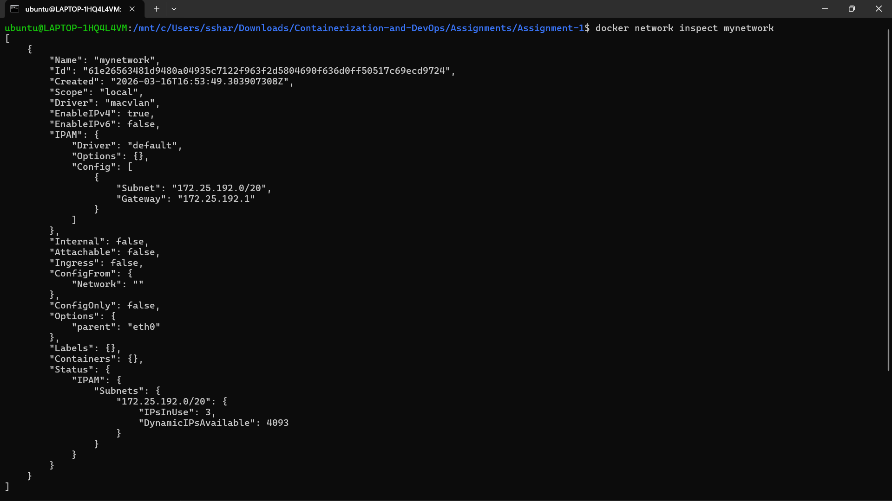
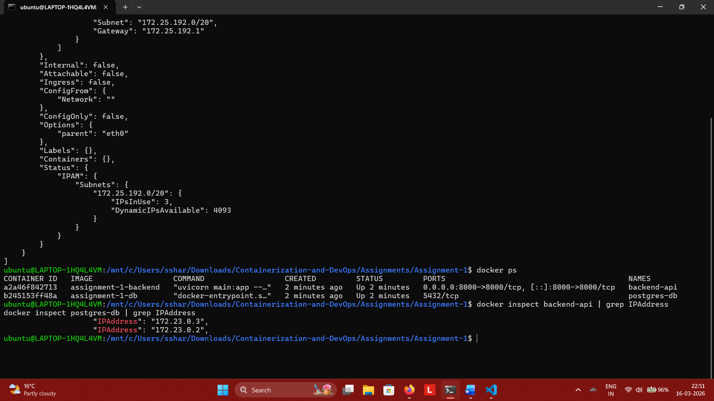
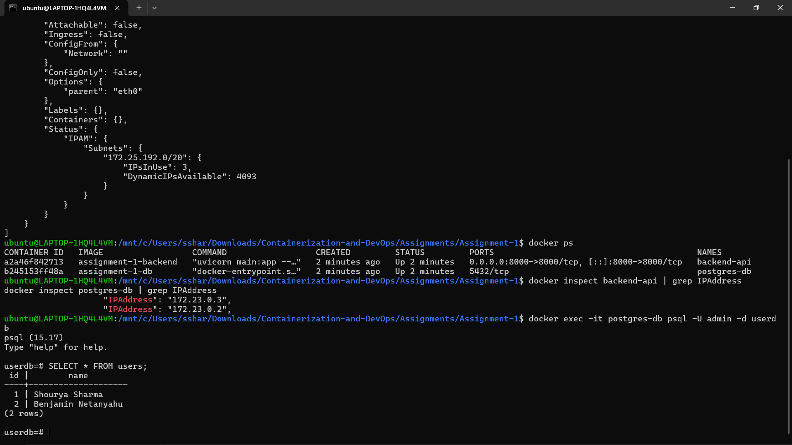
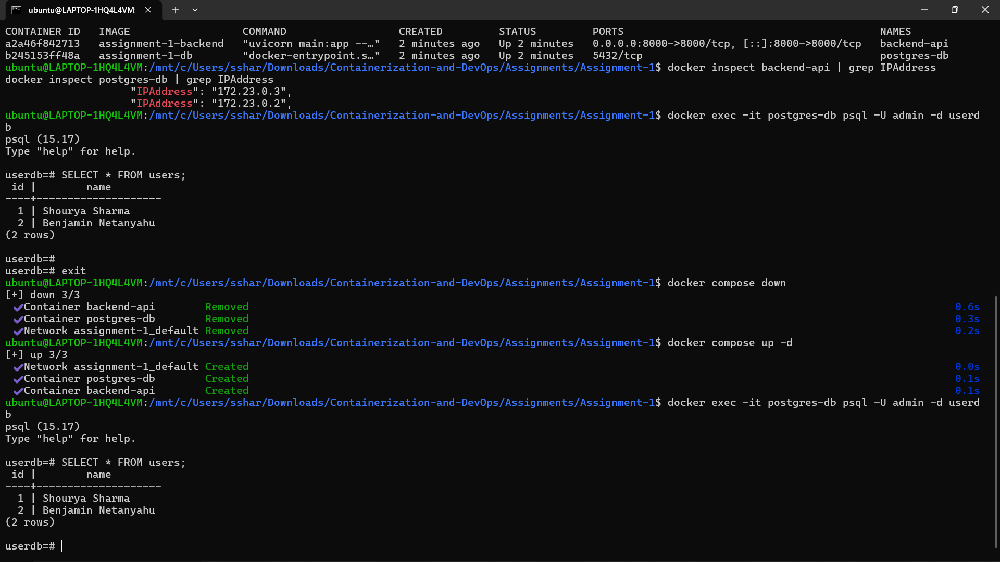
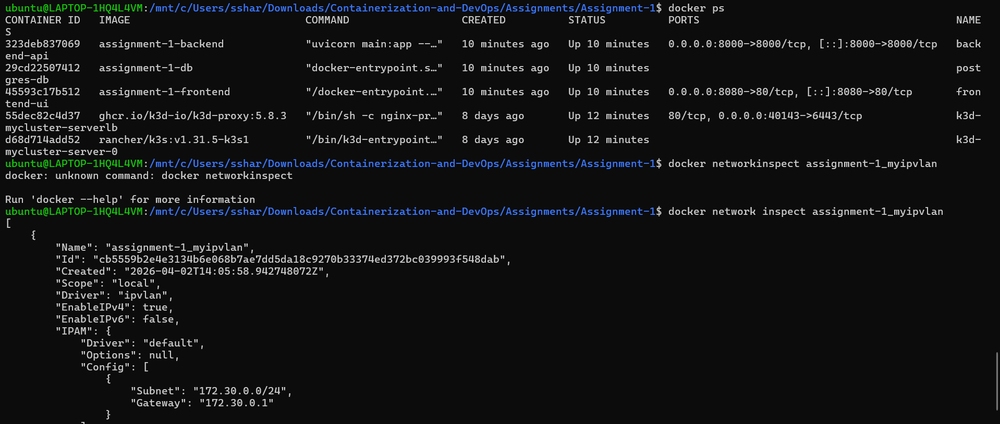
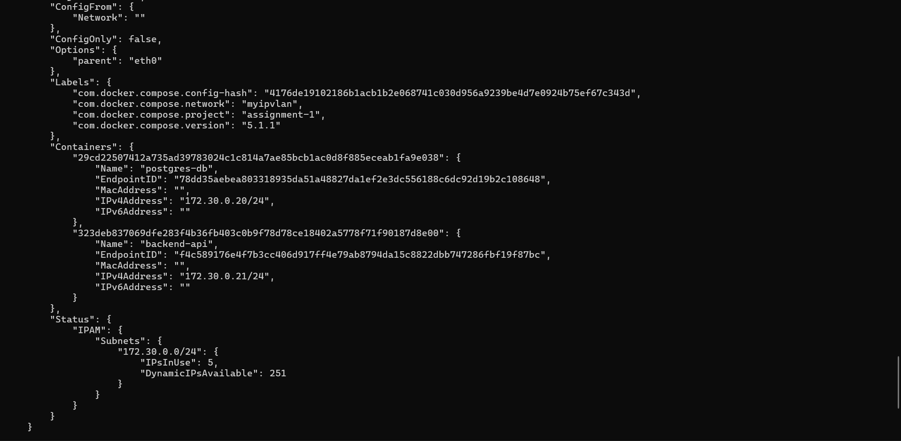
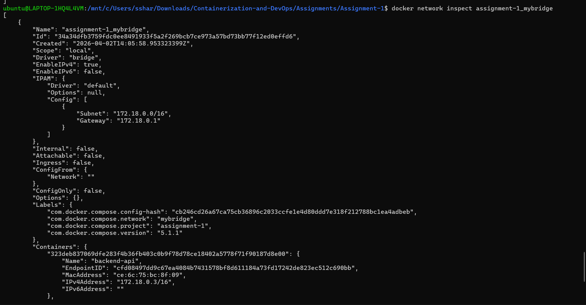
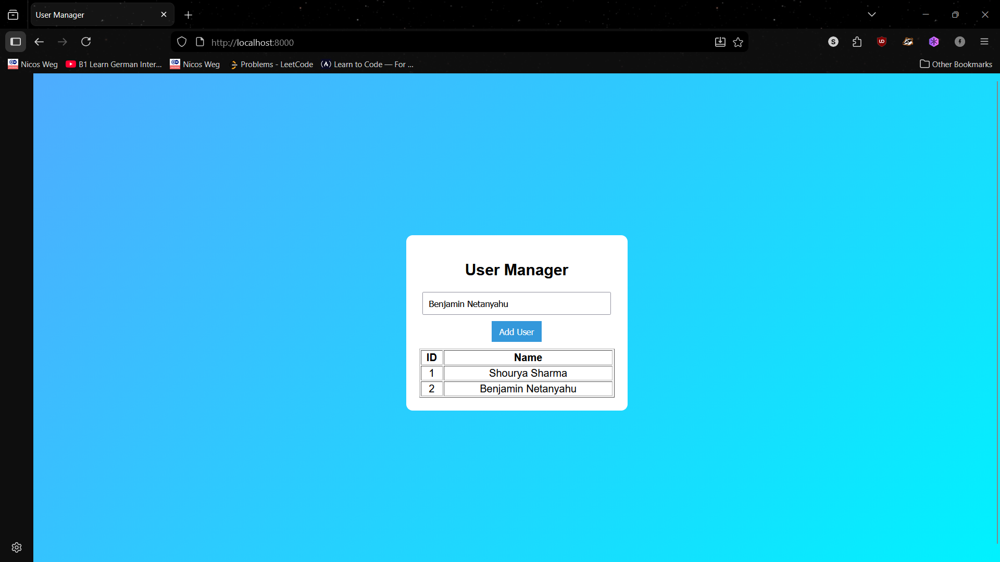
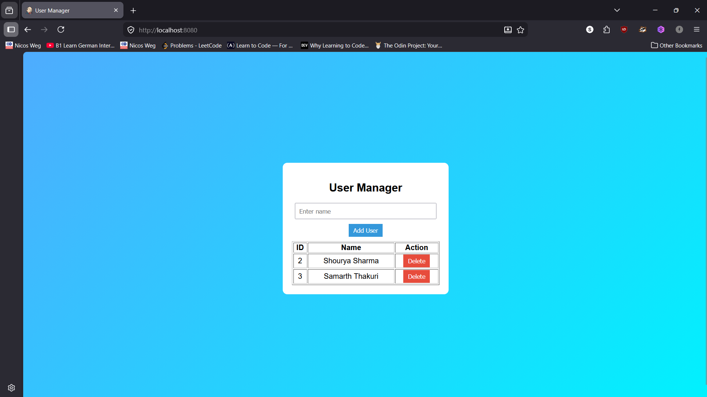

# Containerized Web Application with PostgreSQL using Docker Compose and Macvlan/IPVLAN

## Overview

This project demonstrates a **containerized web application** built using Docker and Docker Compose.

The system consists of a **backend API and a PostgreSQL database**, deployed as separate containers and connected using **Macvlan/IPVLAN networking with static IP addresses**.

---

# Architecture

```
Client Browser
      │
      ▼
Backend API (Container)
      │
      ▼
PostgreSQL DB (Container)
```

---

# Project Structure

```
containerized-webapp
│
├── backend
├── database
├── docker-compose.yml
├── README.md
└── report
```

---

# Functional API Endpoints

## Insert Record

```
POST /records
```

---

## Fetch Records

```
GET /records
```

---

# Create Networks (Macvlan)

```bash
docker network create -d macvlan \
--subnet=172.25.192.0/20 \
--gateway=172.25.192.1 \
-o parent=eth0 \
mynetwork
```

### Network Inspection


---

# Build and Run Containers

```bash
docker compose up -d
```

### Containers Running


---

# Verify Container Networking

```bash
docker inspect postgres-db | grep IPAddress
docker inspect backend-api | grep IPAddress
```

### Container IP Addresses


---

# Database Verification

```bash
docker exec -it postgres-db psql -U admin -d userdb
SELECT * FROM users;
```

### Database Output


---

# Docker Compose Restart Test (Persistence)

```bash
docker compose down
docker compose up -d
```


### Compose Down & Up


---
### Observation
#### Because this is macvlan, we cannot access the website from the localhost. So, it is better to use a ipvlan between the backend and db containers and connect backend and frontend through bridge network

### Networks Inspection After Ipvlan and Bridge





# Web Application UI

Open in browser:

```
http://localhost:8000
```

### Frontend UI

#### Added Delete Functionality

---

# Key Features

- Dockerized backend API
- PostgreSQL container
- Docker Compose orchestration
- Macvlan networking with static IPs
- Persistent storage using volumes
- Verified container communication
- Working frontend UI

---

# Conclusion

This project demonstrates a **production-style containerized architecture** using Docker and advanced networking.

It showcases:

- Container orchestration
- Persistent storage
- Networking (Macvlan/IPVLAN)
- Backend + DB integration