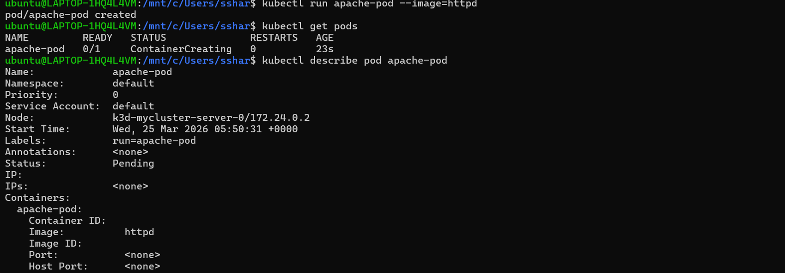
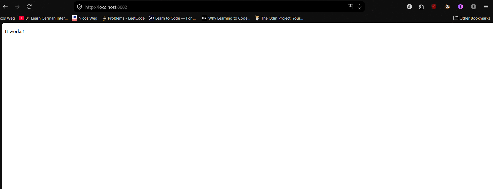
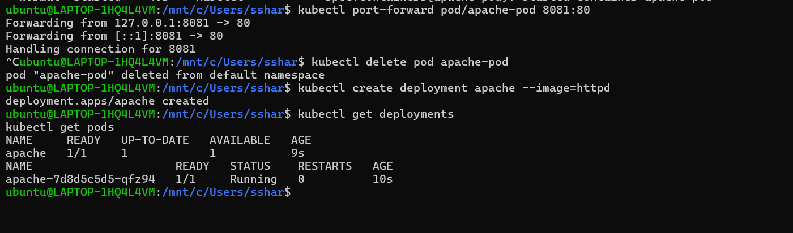
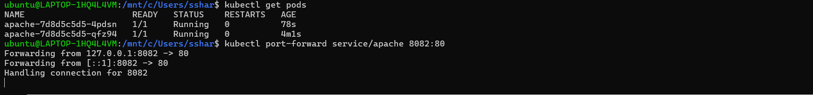
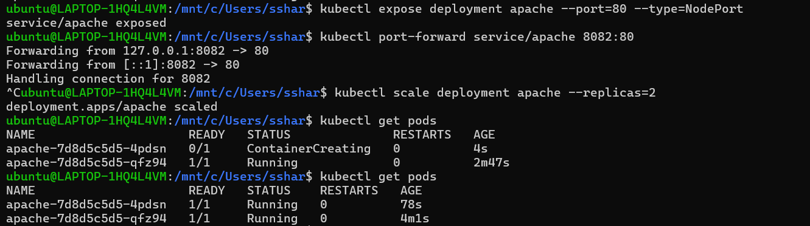
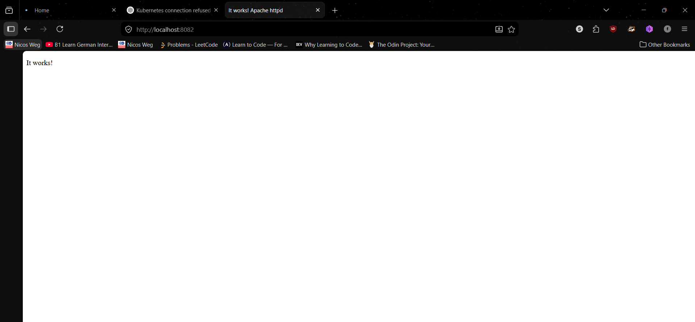
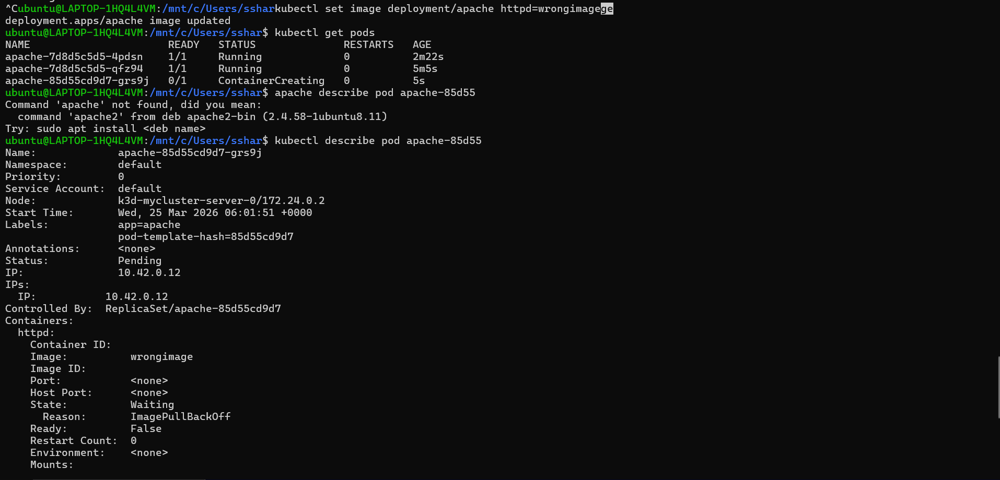
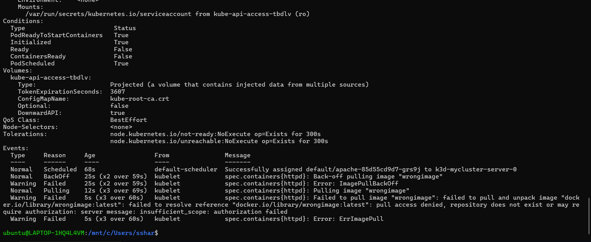
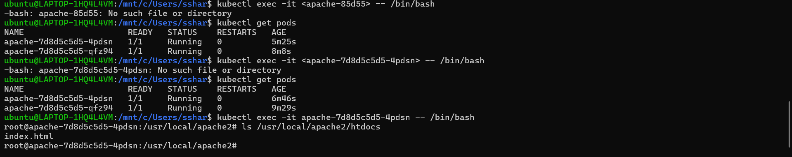
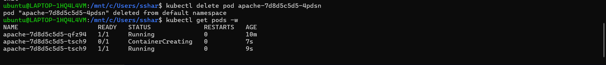

# Run and Manage a “Hello Web App” (httpd)

## Step 1: Run a Pod

## Step 2: Inspect Pod

## Step 3: Access the App

## Step 4: Delete Pod

## Step 5: Create Deployment

## Step 6: Expose Deployment

## Step 7: Scale Deployment

## Step 8: Test Load Distribution (Basic)

## Step 9: Break the App

## Step 10: Diagnose

## Step 11: Fix It

## Step 12: Exec into Pod

## Step 13: Delete One Pod

## Task: Cleanup
